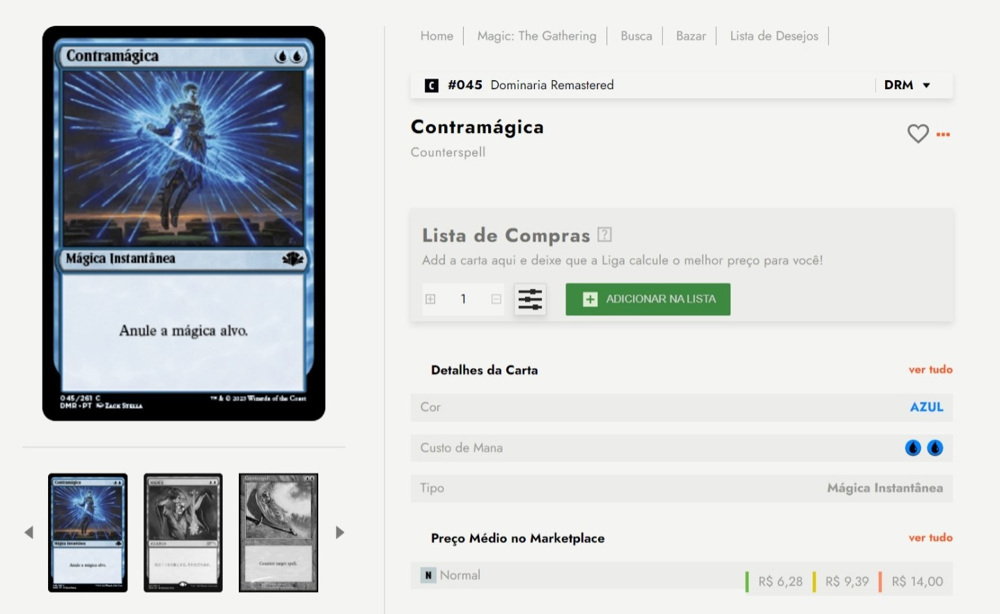

# Liga Magic Challenge

## Visão Geral

Este projeto, intitulado "Liga Magic Challenge", concentra-se em criar uma interface web responsiva e visualmente atraente para explorar cartas do Magic: The Gathering. O projeto utiliza HTML, CSS e JavaScript para alcançar uma experiência de usuário dinâmica e interativa.

## Estrutura do Projeto

### Estilos CSS

Os arquivos CSS (`colors.css`, `reset.css`, `main.css`, `responsive.css`) definem estilos para diferentes componentes e garantem um layout consistente e visualmente agradável.

## Estilos e Layout

- **Fontes:** Utiliza a fonte "Jost" como proposto no layout do Figma.
- **Cores:** Usa uma paleta de cores suaves com tons de cinza, azuis, verdes e laranjas.
- **Layout:** Design responsivo garante uma experiência contínua em diferentes dispositivos.

## Funcionalidade JavaScript

- **Favoritos:** Clicar no ícone de coração marca um cartão como favorito, indicando visualmente seu status.
- **Navegação no Carrossel:** Permite aos usuários navegar por várias imagens de cartões no carrossel.
- **Gerenciamento da Lista de Compras:** Permite aos usuários incrementar ou decrementar a quantidade de cartões em sua lista de compras.
